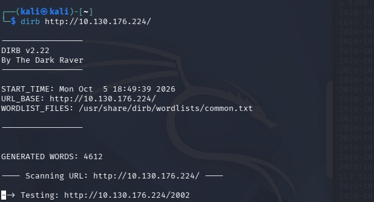
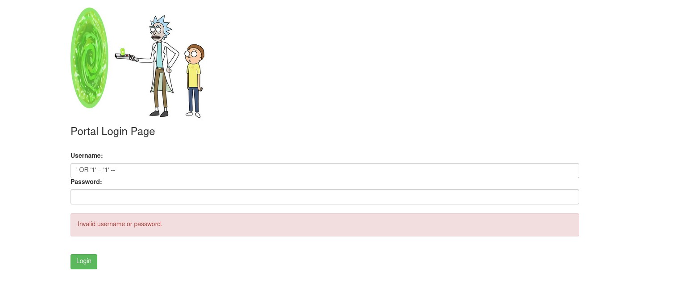
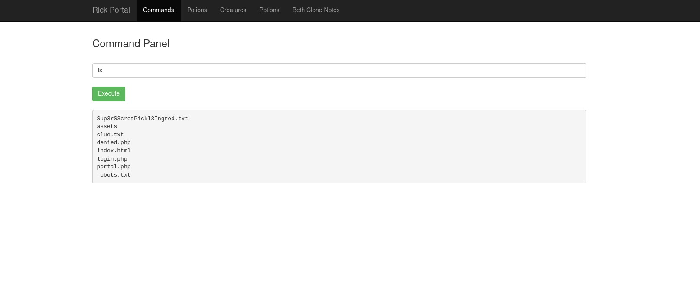

# Pickle Rick - CTF 🥒🚩

## Introduction
In the first place I did the recon and info gathering, after that I explore the ports.
 
 
Tools used:
<ul>
    <li>nmap
    <li>dirb
    <li>curl
    <li>ssh
    <li>nc
</ul>

### Recon & Info_Gath
First of all, turned on the tryhackme vpn so I can do the challenge. 
The first tool I used was `nmap`👁️ to see the open ports that the target might have had.

    

     
    the command: 
    <h3 align=center><code>nmap -Pn -sV &lt;target&gt; </code></h3>

 
means the following sets: 
<ul>
<li>-Pn : Treat the host as active  
<li>-sV : See the versions of the services 
 </ul>
 
Then I just write in the Notpad the info, for example:

<pre>
    IP:10.130.176.224
    
    nmap:
        service : port - version
        ssh : 22 - OpenSSH 8.2p1 Ubuntu 4ubuntu0.11 (Ubuntu Linux; protocol 2.0)
        http : 80 - Apache httpd 2.4.41 ((Ubuntu))

    OS: Linux; CPE: cpe:/o:linux:linux_kernel
</pre>
 
Then I see the http port and investigate the page with curl. I end up comming across a commentary the rick let: 
<h4 align=center>
    <code>&lt;!--  Note to self, remember username!  Username: R1ckRul3s --&gt;</code>
</h4>
 
and wrote it down in the notepad too. 
<pre>
    main page :
        - found commentary _ important:
            Username: R1ckRul3s
</pre>
 
Now I use dirb so I can see the paths the page has. 
In this case I Don't specify the wordlist because the common one is sufficient. 

    

 
It ended up giving me some interesting paths, and as you know, also noted it in the notepad. 

<pre>
    dirb:
        + http://10.130.176.224/assets/ - non interesting
        + http://10.130.176.224/robots.txt - interesting
        + http://10.130.176.224/index.html - interesting
        + http://10.130.176.224/server-status - non interesting
        + http://10.130.176.224/login.php - interesting
</pre>

I started opening and seeing every URL, the assets wasn't interesting, the robots.txt had something writed: `Wubbalubbadubdub`, also noted it, index.html was the main page, server-status was forbidden and the most interesting.. the login.php, an as the path say login page, I tried to use a sqli but it didn't work. 

    

 
I remembered of the notes, Username: R1ckRul3s and tried the Wubbalubbadubdub as the password, and well it worked. 
Now I had a command panel, I used ls to see the files 

    

 

After seeing the files I tried to use `cat` to see the "Sup3rS3cretPickl3Ingred.txt" and the "clue.txt" but i couldn't, so i search other ways to see and txt file and tried: `grep . <file> ` , it basically search everything in the file and print it . 
Well, I did it in the "Sup3rS3cretPickl3Ingred.txt" and it gave me the first flag `mr. meeseek hair`. 
Also did it in the "clue.txt" and it showed me `Look around the file system for the other ingredient.`. 
But I really didn't want to use the command panel page so I did an reverse shell with Python 

...need to continue

