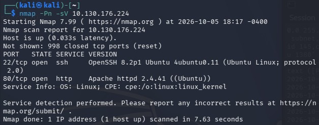

# Pickle Rick - CTF

## Introduction
In the first place I did the recon and info gathering, after that I explore the ports.
 
 
Tools used:
<ul>
    <li>nmap
    <li>dirb
    <li>curl
    <li>ssh
    <li>nc
</ul>

### Recon & Info_Gath
After I turned on the tryhackme vpn --

Step by Step of what I did:

    nmap:
        - Used nmap and saw the open ports of the
        

    

